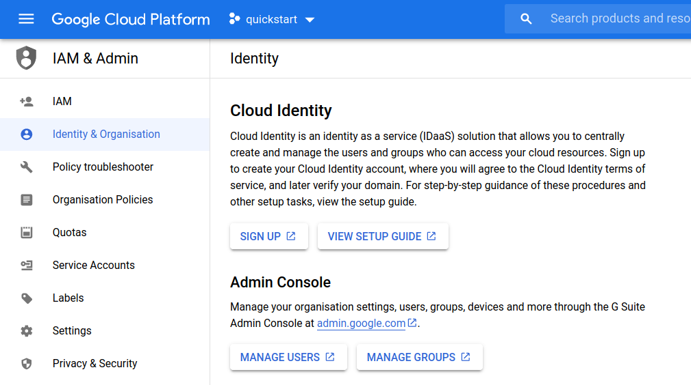

**********************
Setup Google Account
**********************

This guide uses a `Shared VPC <https://cloud.google.com/vpc/docs/shared-vpc>`_ setup, which requires creating a GCP organisation. For this we need either a Google *Cloud Identity* account, or a *GSuite* account.

Here we'll create a **Google Cloud Identity** account because it has a `free edition` while GSuite does not. Creating a Cloud Identity account *requires that you own a DNS domain name*.

Creating a Cloud Identity account
================================================

- Sign in to any regular Google account and go to: https://console.cloud.google.com/
- If the menu on the left is hidden, click the hamburger on the top left. |hamburger_image|
- Go to IAM & Admin -> Identity & Organization.
- Click "Sign Up" and follow the steps. You will be asked for a domain name and to verify that you own it.

Your new account will be something like your_name@my-domain.com. Don't worry if it's not a real email address.

Enable Billing
================================================

Google prohibits the use of some services if you haven't added a billing account with your credit card information. You shouldn't be charged if you have credits remaining on your free trial but our build scripts won't work unless a billing account is attached.

- Go to Billing -> Overview
- If you're logged in to a new account, you will be on a free trial. Click "upgrade" to enable billing.
- Add a billing account or link to an existing billing account.

.. Hint:: If you're new to Google Cloud Platform, consider singing out of all other accounts for the duration of this tutorial. The web console sometimes switches accounts by itself which is confusing if you're not used to it.