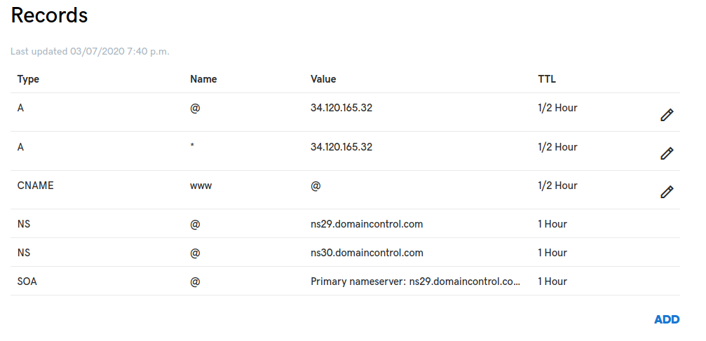

*********************************
Provision resources
*********************************

Provision network resources:
-------------------------------------

.. code-block:: console

    $ cd build/

    $ ./2-provision-network-resources.sh

This creates firewall rules and a NAT router in *vpc-host-project-<uuid>*. You can view their configuration in: *infrastructure/cluster-networking/main.tf*

Build base VM image
-------------------------------------

.. code-block:: console

    $ ./3-build-base-image.sh

This uses Packer to build a Ubuntu 20.04 image with Consul, Nomad and Vault installed. To use Ubuntu 18.04 simply change ``source_image_family`` in *build/vm_images/hashi_base.pkr.hcl*

Provision cluster instances
-------------------------------------

.. code-block:: console

    $ ./4-provision-cluster-instances.sh

This runs ``terraform apply`` on the resources described in: *infrastructure/cluster-nodes/*

You will see your new instances here: https://console.cloud.google.com/compute/instances  (be sure your GCP account and service project `hashi-cluster-xxxx` are selected)

Configure your domain name DNS
----------------------------------

Set your domain name DNS record to point to the load-balancer's public IP address, you will find this in `build/conf/project-info.json` at: ``load_balancer_public_ip_address``. Your DNS config should look something like this:

You may want to wait for your new DNS settings to propagate before continuing. Ping your domain name until the new IP address appears.

Initialize the cluster
-------------------------------------

.. code-block:: console

    $ ./5-initialize-hashi-cluster.sh

This transfers credentials keys to `hashi-server-1` and launches a set of Ansible playbooks to bootstrap Consul, Nomad and Vault. It will take 10-15 minutes to complete, this includes waiting for Google Cloud to provision your SSL certificates.

If it succeeds you will see the following:

.. code-block:: console

    waiting for SSL cert to provision and for successful ping from Traefik. This may take up to 15 minutes.
    attempting request to: https://your-domain.com/ping
    attempting request to: https://your-domain.com/ping
    attempting request to: https://your-domain.com/ping

    Ping success! Your cluster is up and running.

To be 100% certain that no errors have occurred, scroll up and check **every** `'PLAY RECAP'` section to ensure that every row has **failed=0**:

.. code-block:: console

    PLAY RECAP *********************************************************************
    10.132.15.192              : ok=4    changed=2    unreachable=0    failed=0    skipped=0    rescued=0    ignored=0
    10.132.15.198              : ok=7    changed=4    unreachable=0    failed=0    skipped=0    rescued=0    ignored=0
    10.132.15.208              : ok=4    changed=2    unreachable=0    failed=0    skipped=0    rescued=0    ignored=0
    10.132.15.215              : ok=4    changed=2    unreachable=0    failed=0    skipped=0    rescued=0    ignored=0
    10.132.15.216              : ok=4    changed=2    unreachable=0    failed=0    skipped=0    rescued=0    ignored=0

Handling failure
~~~~~~~~~~~~~~~~~~~~~~~~~~~~~~~~~~~

Sometimes, about 10% of the time, this script will fail unexpectedly. To try again run:

.. code-block:: console

    $ cd infrastructure/cluster-nodes
    $ ./tf_destroy.sh
    $ ./tf_apply.sh

    $ cd ../../build/
    $ ./5-initialize-hashi-cluster.sh

.. tip::

    If it keeps failing with the same error, `submit an issue on github`__ with your error, or `schedule a call with me`__ for assistance.

__ https://github.com/rossrochford/gcp-hashi-cluster/issues/new
__ https://calendly.com/ross-rochford/gcp-hashi-cluster

Get your tokens
~~~~~~~~~~~~~~~~~~~~~~~~~~~~~

Scroll up and you will see that some tokens were printed to the terminal:

.. code-block:: console

    consul bootstrap token:                           byg27910-ih8d-f910-g831-9t4794d2a25h
    consul UI token (read/write):                     ec15675e-2999-d789-832e-8c4794daa8d7
    consul UI token (read-only):                      1bisj84s-0vnc-9vc2-98jd-sdfs3dfg4354
    vault root token:                                 snds92v2-7f9s-a7c6-8d7a-n7aysz93m1g1

- Copy these tokens and store them somewhere safe. The Consul bootstrap token has write privileges on every Consul resource and can be used to create additional highly privileged tokens.
- We will use the Consul UI token (read/write) to log in to the Consul web dashboard.

Clean up initialization data
~~~~~~~~~~~~~~~~~~~~~~~~~~~~~

The Ansible playbooks leave a trail of sensitive data behind in /tmp/ansible-data/ on every instance and the syslogs may contain sensitive tokens. Run this script to remove this data.

.. code-block:: console

    $ ./6-remove-initialization-data.sh