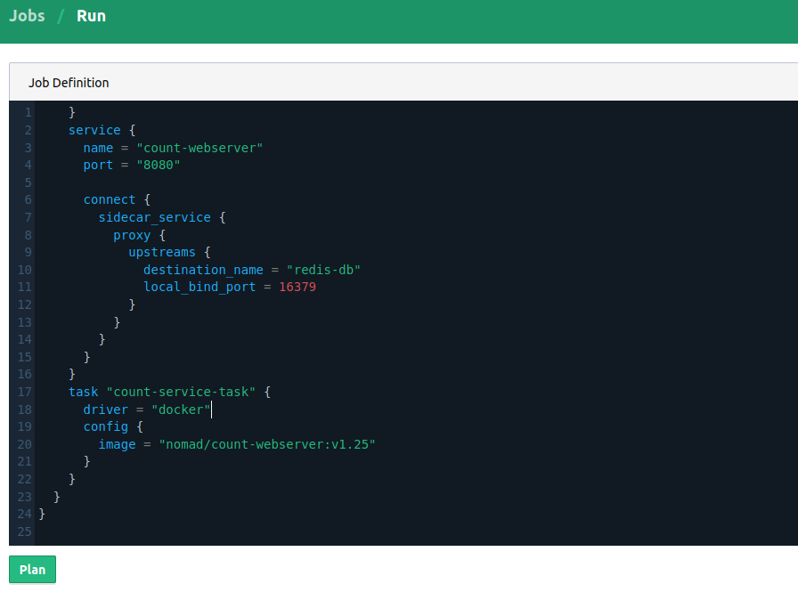

create_vault_tls_certs*********************************
Deploy your first service
*********************************

To demonstrate how to use Consul/Nomad to host containerized services, we're going to deploy a simple Flask web-service with a Redis database, and add a route in Traefik so that it is accessible from the public internet.

Build the Docker image
----------------------------------------------------

.. code-block:: console

    $ cd gcp-hashi-cluster/docs/tutorials/flask-redis-counter/count-service/
    $ ./build_image.sh

    Step 6/8 : ENV PYTHONPATH /app
     ---> Using cache
     ---> bbe1559dc882
    Step 7/8 : ENV PORT 8080
     ---> Using cache
     ---> a5714a7f9d43
    Step 8/8 : CMD ["python", "/app/main.py"]
     ---> Using cache
     ---> 40fa80bc1e8c
    Successfully built 40fa80bc1e8c
    Successfully tagged eu.gcr.io/hashi-cluster-cbj98124-7cb8/count-webserver:v0.1

This tag is of a **local** Docker image, it has not yet been pushed to a GCP container registry.

.. _pushing_docker_images:

Push the Docker image
----------------------------------------------------

.. code-block:: console

    $ cd gcp-hashi-cluster/operations/  # operations scripts must be run from here

    $ ./nomad/push-docker-image.sh eu.gcr.io/hashi-cluster-cbj98124-7cb8/count-webserver:v0.1

    Success! Your image will be available to Nomad as:  'nomad/count-webserver:v0.1'

This pushes your image to a private GCP container registry and then launches an Ansible playbook to pull it on every Nomad client node.

.. important::

    Due to an unresolved configuration issue, Nomad won't be able to pull images from a private GCP container registry. As a workaround the script above pulls images outside of Nomad and gives them a local tag in the form: `nomad/your-service:v0.1`. You will need to use this tag in your Nomad jobs.

Submit the webserver Nomad Job
--------------------------------------

- Go to https://nomad.your-domain.com/ui
- Authenticate with your dashboard username and password (set in build/conf/project-defaults.json)
- Click **Run Job** in the top right.
- Copy/paste the contents of ``docs/tutorials/flask-redis-counter/count-webserver.nomad`` in here, ensure the Docker image tag is correct.
- Click **Plan** and the **Run**

Notice the ``sidecar_service { }`` stanza configures an `upstream` connection to a service ``redis-db`` and makes it available at a `local_bind_port`: ``16379``. This can be set to any valid port and doesn't have to match the port of the target service. The container within `count-service-task` can fetch this value from an environment variable ``NOMAD_UPSTREAM_PORT_redis-db``.

Submit the Redis Nomad Job
--------------------------------------
We'll use a public image for Redis so there is no need to build or push it, simply submit this job to Nomad: ``docs/tutorials/flask-redis-counter/count-webserver.nomad``

Add a Consul intention
-----------------------------

Nomad will have registered two Consul services ``count-webserver`` and ``redis-db``. To allow them communicate via the `Consul Connect`__ service mesh we must create an explicit `intention`__. The initialization script already added a ``Traefik -> *`` intention (which you may prefer to replace), we will now add a ``count-webserver -> redis-db`` intention:

__ https://www.consul.io/docs/connect
__ https://www.consul.io/docs/connect/intentions

- Go to https://consul.your-domain.com/ui
- Authenticate using your dashboard username and password, same as with the Nomad UI.
- You will also need to login using an ACL token. Click **login** on the top right, and paste your `Consul UI token (read/write)` from step 4.5.2.
- Navigate to **Intentions** and click **Create**
- Select `count-webserver` as the Source Service and `redis-db` as the Destination Service, choose *Allow* and click **Save**

Create a routing rule in Traefik
-----------------------------------

Routes in the Traefik instance are configured in ``/etc/traefik/dynamic-conf.toml``. This gets rendered dynamically by `consul-template`__.

__ https://github.com/hashicorp/consul-template

.. tip::

    The implementation underlying how service routes are updated on Traefik servers is little obtuse (see: `services/traefik/systemd/watch-traefik-routes-updated.service`), you may prefer to disable this and simply maintain `dynamic-conf.toml` manually as a static file.

Create a json file with the following content:

.. code-block:: json

    {
        "dashboards_ip_allowlist": ["0.0.0.0/0"],
        "routes": [
            {
                "traefik_service_name": "count-webserver",
                "consul_service_name": "count-webserver",
                "routing_rule": "PathPrefix(`/counter`)",
                "connect_enabled": true
            }
        ]
    }

- This defines a Traefik `service`__ and `router rule`__ that routes incoming HTTP requests to our ``count-webserver`` service via a `Consul Connect sidecar proxy`__.

__ https://docs.traefik.io/routing/services/
__ https://docs.traefik.io/routing/routers/#rule
__ https://www.consul.io/docs/connect/proxies

.. tip::

    The PathPrefix should be a valid prefix in your service's HTTP API. With a little extra configuration, Traefik can also add/remove path prefixes before forwarding requests to services (see: `StripPrefix`, `HeadersRegexp`).

Next run the following script to publish your service routes:

.. code-block:: console

    $ cd gcp-hashi-cluster/operations/traefik/
    $ ./overwrite-service-routes.sh <my-routes.json>

This uploads the json file and re-renders configurations for Traefik and its local sidecar proxy.

Verify your services are working
-----------------------------------

- Go to https://traefik.your-domain.com/ and authenticate with your dashboard username/password. You should see that a new route and service has been created. Note that a service in Traefik isn't equivalent to a Consul service but we're linking them together here with a route.
- Next visit https://your-domain.com/counter/hello and it should say "Hello" back!
- Finally test the counter, go to: https://your-domain.com/counter/increment . You should see the number 1 and this should increment on every refresh. If this fails it means `count-webserver` cannot connect to `redis-db`.

.. tip::

    If any of these steps fail, `submit an issue on github`__ with your error, or `schedule a call with me`__ for assistance.

__ https://github.com/rossrochford/gcp-hashi-cluster/issues/new
__ https://calendly.com/ross-rochford/gcp-hashi-cluster

Storing secrets in Vault
----------------------------------

Suppose our counter service needs to authenticate with a 3rd party API, we don't want to place keys directly in the application code. Vault integrates with Nomad to deliver sensitive secrets to applications.

The write-only Vault token generated earlier allows writing secrets to this a path ``secret/nomad/``. `Vault-server-1` has this set as its ``VAULT_TOKEN`` environment variable, for convenience.

- Create a json file with a path (prefixed by `secret/nomad/`) and some fields/values to store.

.. code-block:: json

    {
        "secret/nomad/counter/social-auth-facebook": {
            "app_key": "16696501350101",
            "app_secret": "731ebc29cne367cv6213c1"
        }
    }

- Run the `write-secrets.sh` script, this connects to `vault-server-1` and runs `vault kv put.`__

__ https://www.vaultproject.io/docs/commands/kv/put

.. code-block:: console

    $ cd operations/
    $ ./vault/write-secrets.sh my-secrets.json

- Uncomment the `vault` and `template` sections in `count-webserver.nomad` and resubmit the job. Due to a quirk in Vault's `KV V2 API`__ the path prefix should be ``secret/data/nomad/`` instead of ``secret/nomad/``  Nomad and Vault have been configured with a policy ``nomad-client-base`` for reading secrets this path.

__ https://www.vaultproject.io/api/secret/kv/kv-v2.html

.. code-block:: console

    /* ... */

    task "count-service-task" {
      driver = "docker"

      config {
        image = "nomad/count-webserver:v0.1"
      }

      vault {
        policies = ["nomad-client-base"]
        change_mode   = "noop"
      }

      template {
        data = <<EOH
          {{ with secret "secret/data/nomad/counter/social-auth-facebook" }}
          FACEBOOK_KEY="{{ .Data.data.app_key }}"
          FACEBOOK_SECRET="{{ .Data.data.app_secret }}"
          {{ end }}
    EOH
        destination = "secrets/file.env"
        env         = true
      }

    }

- Your secrets will be available to the service containers as environment variables: ``FACEBOOK_KEY`` and ``FACEBOOK_SECRET``.

Creating a Vault scope-limited user
-----------------------------

First, enable the Userpass auth method:

.. code-block:: console
    vault auth enable userpass

Next, add yourself as a Vault user without any policies:

.. code-block:: console
    vault write auth/userpass/users/<name> password=<pwd>

Be sure to specify an actual username for <name> and a password for <pwd> without the angle brackets.

Now, you can sign into the Vault UI by selecting the Username method and providing your username and password.

You can also login with the Vault CLI:

.. code-block:: console
    vault login -method=userpass username=<name> password=<pwd>

Both of these login methods give you a Vault token with Vault's default policy that grants some very limited capabilities.

To confirm that your new token is being used, run this command:

.. code-block:: console
    vault token lookup

You will see that the display_name of the current token is "userpass-<name>" where <name> is your username and that the only policy listed for the token is the "default" policy.

Try to read the secret you wrote to the KV v2 secrets engine in the last challenge:

.. code-block:: console
    vault kv get kv/a-secret

You will get an error message because your token is not authorized to read any secrets yet. That is because Vault policies are "deny by default", meaning that a token can only read or write a secret if it is explicitly given permission to do so by one of its policies.

Suppose we want distinct secret paths per user. Create a file user-policy.hcl, replacing the <user> strings:

.. code-block:: console
    path "secret/data/<user>/*" {
        capabilities = ["create", "update", "read", "delete"]
    }
    path "secret/delete/<user>/*" {
        capabilities = ["update"]
    }
    path "secret/metadata/<user>/*" {
        capabilities = ["list", "read", "delete"]
    }
    path "secret/destroy/<user>/*" {
        capabilities = ["update"]
    }
    # Additional access for UI
    path "secret/metadata" {
        capabilities = ["list"]
    }

Now add this policy to vault and assign it to your user:

.. code-block:: console
    vault policy write the-user-policy /vault/policies/user-policy.hcl
    vault write auth/userpass/users/<user_1>/policies policies=the-user-policy

Your user will now be permitted to do read and write from the `secret/<user>` prefix path:

.. code-block:: console

    vault kv get secret/<user>/age
    vault kv put secret/<user>/weight weight=150

