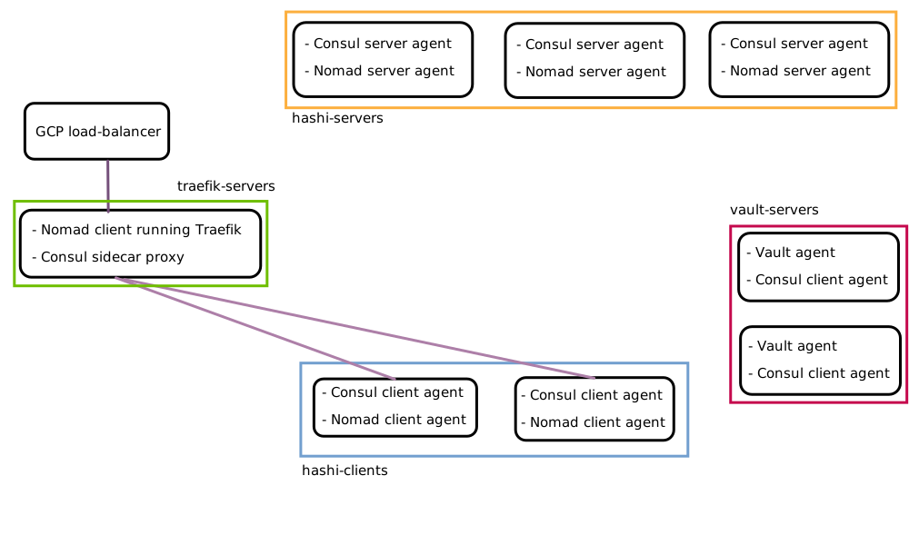

gcp-hashi-cluster: a Consul/Nomad cluster for Google Cloud
=================================================================================================

**gcp-hashi-cluster** is a pre-configured cluster for running Hashicorp's Consul, Nomad and Vault on Google Cloud Platform.

It is designed to get you up and running quickly with minimal configuration and sensible defaults. No prior knowledge of Consul, Nomad or GCP is assumed. This guide will have you running containerized services, accessible from HTTPS endpoints, in under an hour.

In order to achieve this, some compromises have been made:

Limitations and opinionated configurations
----------------------------------------------
- The cluster is configured to run in a **single** region, though VMs are spread across multiple zones for high availability.
- All VMs run Ubuntu 20.04 (18.04 is also supported). To use another OS you will need to modify the packer scripts. The the local build scripts (mainly bash and Terraform) have only been tested on a Ubuntu development machine.
- It's assumed you have a DNS domain name for this cluster. One domain name per cluster is assumed, though you may add additional sub-domains of this. Traefik is used as the cluster's reverse proxy, fronted by a Google load-balancer that manages the SSL certificates.
- This guide uses a `Shared VPC <https://cloud.google.com/vpc/docs/shared-vpc>`_ setup so we can run separate "service projects" with shared networking configuration at the organization level. Although this is good practice, it means a regular Gmail account won't do, you'll need a Cloud Identity or GSuite user account so you can create a GCP Organization.
- The GCP IAM user/resource permissions configurations used here are intended to get you started quickly as a lone developer. You may want more fine-grained IAM restrictions if you're using this within a large development team. The same is true for the Consul, Nomad and Vault ACL configurations.

The cluster looks something like this:

Typically there are 3 Consul/Nomad servers and at least 1 Vault server. Your services run on the hashi-clients and communicate via a `Consul Connect`__ service mesh. The GCP load-balancer receives incoming requests and Traefik routes them to the services via a Consul Connect sidecar proxy.

__ https://learn.hashicorp.com/consul/getting-started/connect

Remaining work
--------------------------------
- Metrics and logging isn't fully integrated with Google Cloud. It's working with some services but not yet with others.
- There is an issue with Nomad being unable to authenticate with the GCP Container Registry, where you typically store private Docker images. :ref:`Here <pushing_docker_images>` is a workaround.
- Although the build scripts will get you up and running, some scripts for day-to-day operations are missing. For example to add a new node to an already-running cluster, there is no script for automating this.
- The instances run in a single region but the load-balancer and public IP address are configured as global resources, this isn't ideal, it means external HTTP clients' may experience higher response latency. Changing this shouldn't be too difficult, see :ref:`this guide<making_load_balancer_regional>`.
- `Forseti <https://github.com/forseti-security/terraform-google-forseti>`_ will be added in future. This will allow you to more easily inspect and monitor your IAM roles, permissions and service accounts.
- The Vault configuration was a little rushed, I followed the official tutorials closely but it needs further inspection. There is also no tutorial included showing how to use Vault.

.. Caution:: This project is a work in progress, it has not been battle-tested in production or audited by security professionals.

.. toctree::
    :maxdepth: 2
    :numbered:
    :glob:

    Homepage <self>
    1_install_requirements.rst
    2_google_account_setup.rst
    3_create_gcp_projects.rst
    4_provision_resources.rst
    5_deploy_your_first_service.rst
    6_destroying_the_cluster.rst
    7_customizing_the_cluster.rst

Contribute
----------

- Source Code: https://github.com/rossrochford/gcp-hashi-cluster

License
-------

The project is licensed under the MIT license.

